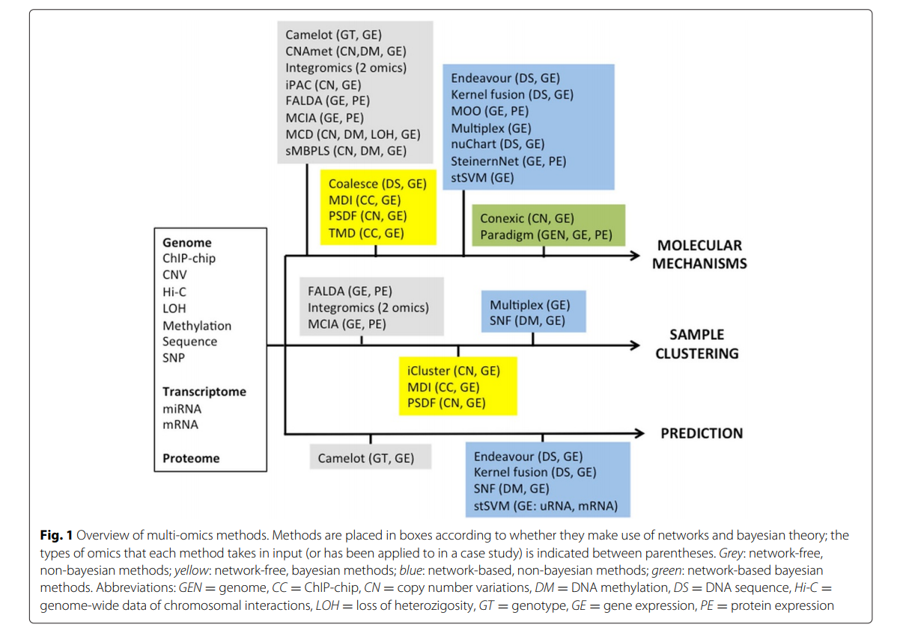
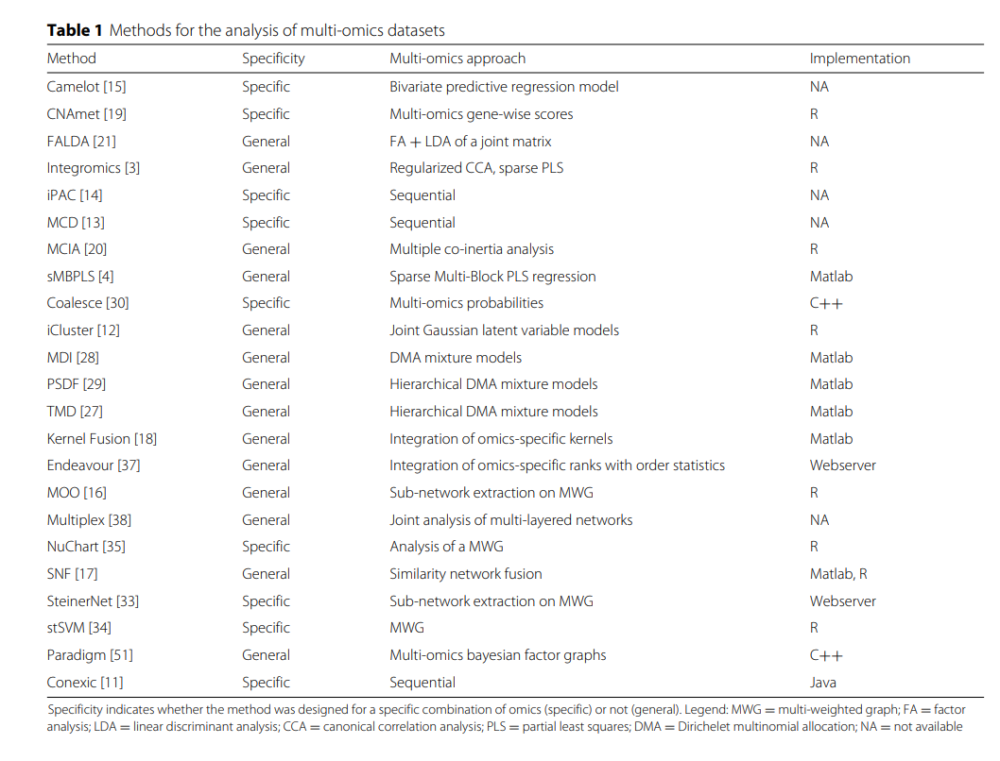

# Résumé de [https://bmcbioinformatics.biomedcentral.com/track/pdf/10.1186/s12859-015-0857-9]
Dans le fond je peux trouver les datasets ici. Regarder dans tous les articles cités ici de type multiomiques pour d'éventuels datasets
# Ressources to look for
[https://www.nature.com/articles/nrg3433]
[https://www.nature.com/articles/nrc3721?cacheBust=1508203918089]
[https://academic.oup.com/bioinformatics/article/25/21/2855/227644]
[https://academic.oup.com/bioinformatics/article/28/19/2458/289993]

# Methods: 2 grandes familles 
1. **Network based methods**: These approaches, designated as “network-based” (NB),
take into account currently known (e.g. protein-protein
interactions) or predicted (e.g. from correlation analysis)
relationships between biological variables. In this
class, graph measures (e.g. degree, connectivity, centrality)
and graph algorithms (e.g. sub-network identification) are
used to identify valuable biological information. [https://www.nature.com/articles/nrg2918]

2. **Bayesian methods**:  that is, it uses a statistical model in
which, starting from an a priori reasonable assumption
about the data probability distribution, parametric or nonparametric,
it is possible to compute the updated posterior
probability distribution making use of the Bayes’ rule;
of course the posterior distribution depends on dataset
measurements
[https://link.springer.com/chapter/10.1007/978-94-011-5014-9_11]
[https://academic.oup.com/bioinformatics/article/22/14/e184/228195]
[https://www.liebertpub.com/doi/abs/10.1089/106652700750050961]

3. 4 sous classifications de methodes:
    1. **network-free non-bayesian (NF-NBY)**, iPAC [14], MCD [13], CNAmet [19], sMB-PLS [4] and Camelot [15].
    2. **networkfree bayesian (NF-BY)**, iCluster [12], MDI [28], Antoniak [26], TMD [27], MDI [28], PSFD [29]
    3. **network-based non-bayesian (NBNBY)**: SteinerNet [33], stSVM [34] and nuChart [35], ENDEAVOUR [37], SNF (Similarity Network Fusion) [17] 
    4. **network-based bayesian (NB-BY)** : Paradigm [51], 

4. Image 

5. Recapitulatifs des outils existants plus leur implémentation 

6. Got to look out for: 
    1. Multiple coinertia analysis MCIA [20]: basé sur l'optimisation de covariance, fait une projection des vues dans le meme espace de dimension: permet d'identifier les biomarqueurs et les clusters
    2. Liu et al. [21] presented a method (shortly FALDA): standardise et merge les datasets multiomics
    3. iCluster Just to see how my dataset are clusterize
    